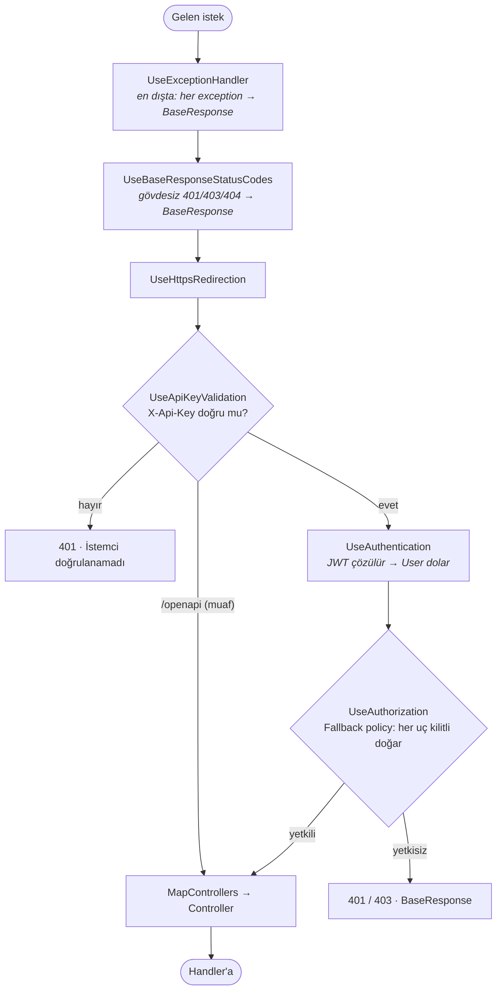
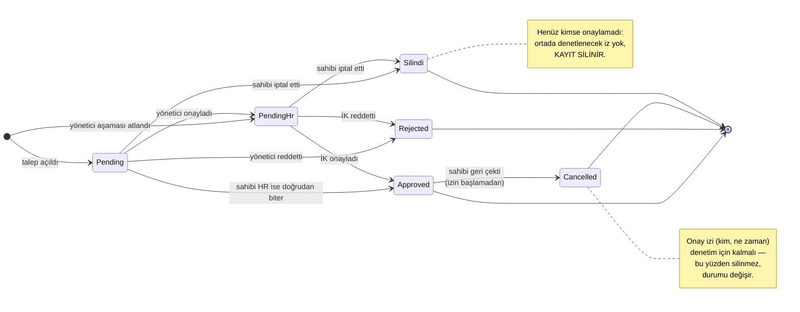
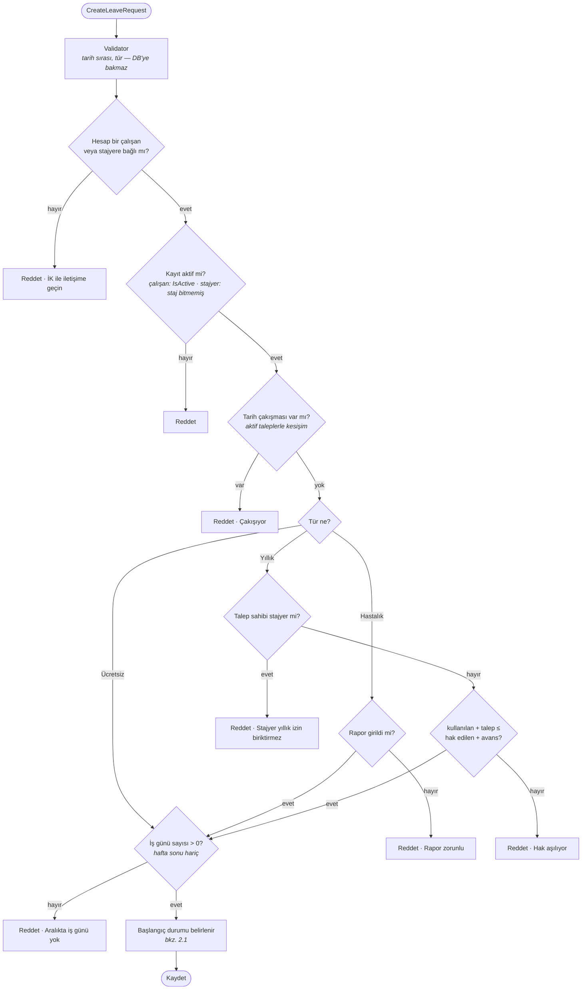
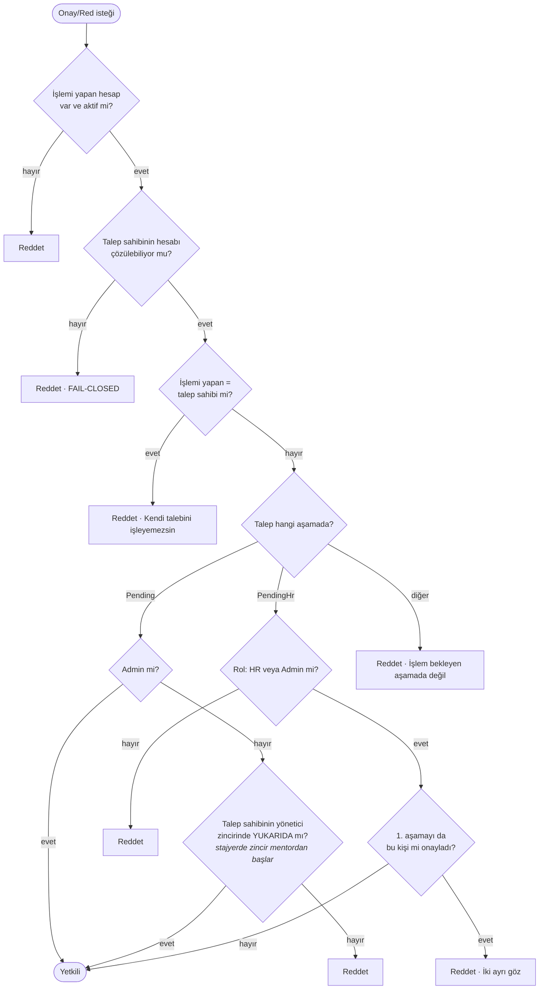
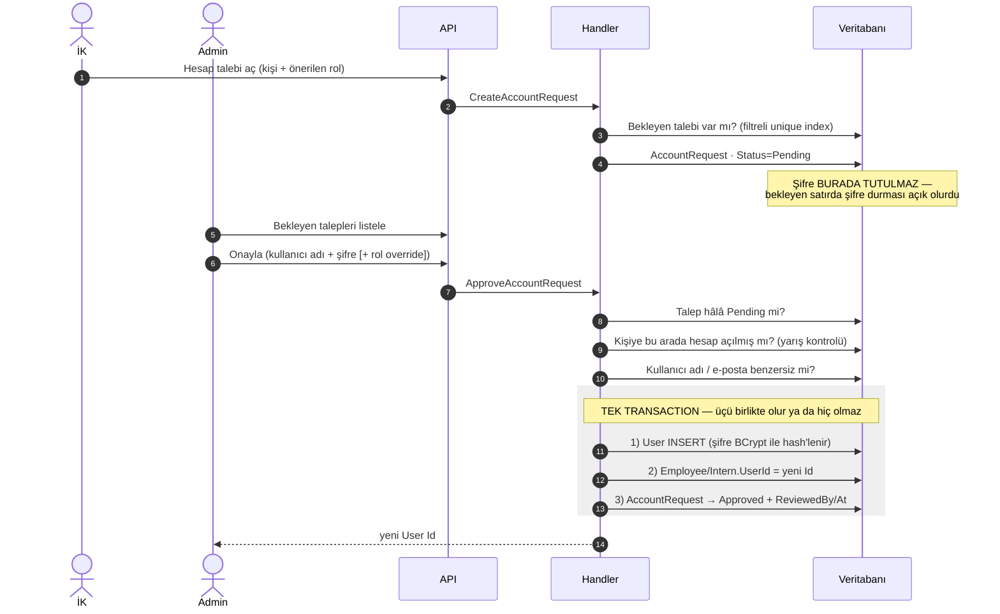
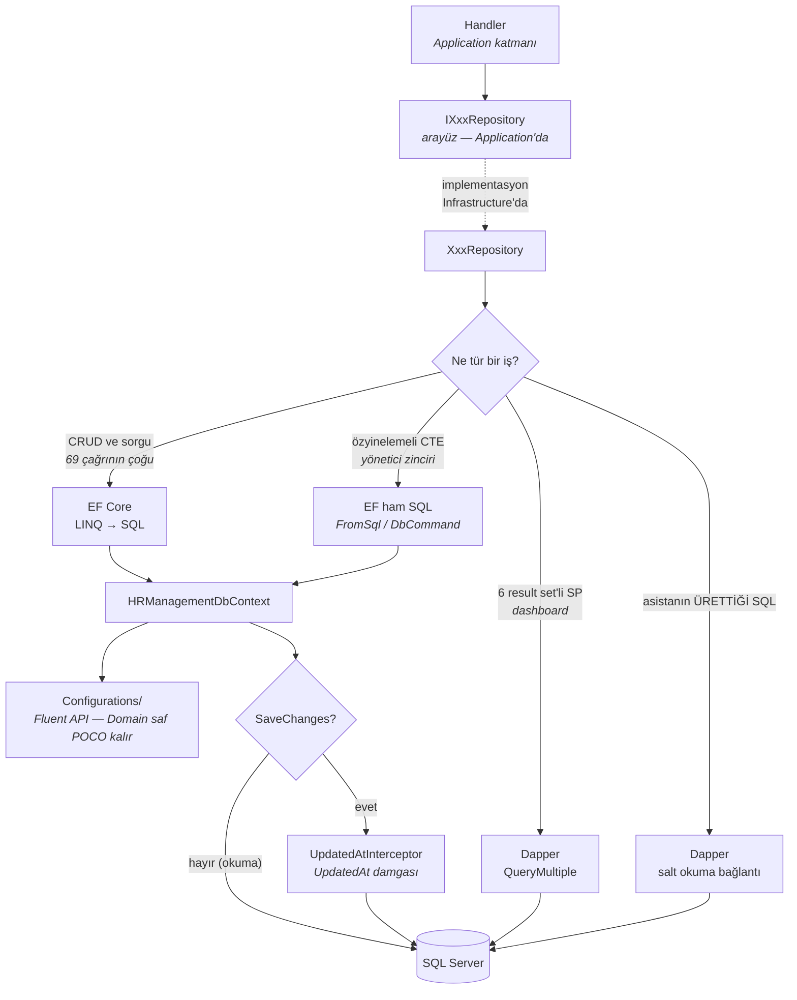
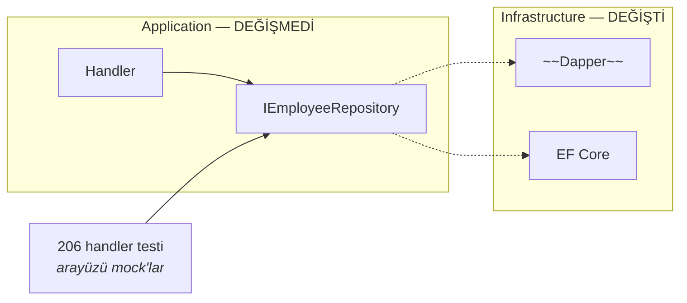

# Akış Şemaları

Bu doküman sistemin **hareket eden parçalarını** gösterir. [veri-modeli.md](veri-modeli.md)
verinin *neye benzediğini* anlatır; burası verinin *nasıl aktığını*.

Diyagramlar Mermaid ile yazılmıştır — GitHub ve VS Code doğrudan render eder.
Kaynak metin olduğu için `git diff` neyin değiştiğini satır satır gösterir;
resim dosyası olsaydı "binary files differ" yazardı ve kimse gözden geçiremezdi.

**Kural: bir diyagram = bir soru.** Tek dev şema yerine her biri tek bir şeyi
anlatan küçük şemalar var; her diyagramın altında ilgili kaynak dosyalar linkli.

---

## İçindekiler

| # | Bölüm | Soru |
|---|---|---|
| 1 | [Katmanlar arası akış](#1-katmanlar-arası-akış) | Bir tık veritabanına nasıl ulaşıyor? |
| 2 | [Talep ve onay akışı](#2-talep-ve-onay-akışı) | İki aşamalı izin onayı nasıl işliyor? |
| 3 | [Hesap açma](#3-hesap-açma) | Kullanıcı hesabı nasıl doğuyor? |
| 4 | [Veri erişim katmanı](#4-veri-erişim-katmanı) | EF Core ile Dapper nerede devreye giriyor? |

> Başlıklarda Türkçe **İ** harfinden kaçınıldı: GitHub başlıkları küçültürken `İ`'yi
> görünmez bir birleşik noktayla (`i` + U+0307) yazar ve elle yazılan bağlantı tutmaz.

---

## 1. Katmanlar arası akış

### 1.1 Uçtan uca: kim kime, hangi sırayla?

```mermaid
sequenceDiagram
    autonumber
    actor K as Kullanıcı
    participant T as Tarayıcı
    participant W as WebUI (MVC)
    participant R as Refit + Handler'lar
    participant A as API boru hattı
    participant M as MediatR
    participant H as Handler
    participant D as Repository + EF Core
    participant S as SQL Server

    K->>T: Formu doldurur / linke tıklar
    T->>W: HTTP + cookie (JWT içeride, JS göremez)
    Note over W: Cookie auth çözülür<br/>Rol bazlı menü/sayfa kontrolü (UX)

    W->>R: IXxxApi.MetotAsync(...)
    Note over R: BearerTokenHandler → "Authorization: Bearer ..."<br/>ApiKeyHandler → "X-Api-Key: ..."

    R->>A: HTTPS isteği (sunucudan sunucuya)
    Note over A: Boru hattı — bkz. 1.2

    A->>M: ISender.Send(Command/Query)
    M->>M: ValidationBehavior (FluentValidation)
    M->>H: Handle(request, ct)

    H->>D: Repository çağrısı
    D->>S: EF Core'un ürettiği SQL
    S-->>D: satırlar
    D-->>H: entity / DTO

    H-->>M: sonuç
    M-->>A: sonuç
    A-->>R: BaseResponse&lt;T&gt; { IsSuccess, Message, Data }
    R-->>W: IsSuccess okunur (exception YOK)
    W-->>T: Razor view
    T-->>K: Ekran
```

**Dikkat edilecek üç nokta:**

- **İki ayrı kimlik var.** Tarayıcı ↔ WebUI arası *cookie*, WebUI ↔ API arası *JWT*.
  Token tarayıcıya hiç verilmez; cookie ticket'ının içinde sunucuda durur.
- **`X-Api-Key` kullanıcıyı değil UYGULAMAYI tanıtır.** "Bu istek benim WebUI'ımdan mı
  geliyor?" sorusunu cevaplar. Sunucudan sunucuya gittiği için tarayıcı bu başlığı görmez.
- **Hata da aynı zarfla döner.** `ProblemDetails` kullanılmaz; istemci her yanıtı tek
  tip okur, bu yüzden Refit'in exception fırlatması kapatılmıştır.

📁 [BearerTokenHandler.cs](../src/HRManagement.WebUI/Services/BearerTokenHandler.cs) ·
[ApiKeyHandler.cs](../src/HRManagement.WebUI/Services/ApiKeyHandler.cs) ·
[WebUI/Program.cs](../src/HRManagement.WebUI/Program.cs) ·
[ValidationBehavior.cs](../src/HRManagement.Application/Behaviors/ValidationBehavior.cs)

### 1.2 API boru hattı: istek hangi kapılardan geçiyor?

Sıra bilinçlidir; her istasyon kendinden sonrakini korur.



**Neden bu sıra:**

| İstasyon | Neden burada |
|---|---|
| `UseExceptionHandler` | En dışta olmalı; içeride patlayan her şeyi yakalar. |
| `UseBaseResponseStatusCodes` | Onun hemen içinde; gövdesiz yanıtlara zarf giydirir. |
| `UseApiKeyValidation` | Kimlikten **önce**: tanınmayan istemci JWT çözülmeden, DB'ye uğramadan elenir. |
| `UseAuthentication` | "Sen kimsin?" — `User`'ı doldurur. |
| `UseAuthorization` | "Yetkin var mı?" — ters yazılırsa daima boş kimlikle karar verir. |

📁 [API/Program.cs](../src/HRManagement.API/Program.cs) ·
[ApiKeyMiddleware.cs](../src/HRManagement.API/Middleware/ApiKeyMiddleware.cs) ·
[StatusCodeResponseExtensions.cs](../src/HRManagement.API/Middleware/StatusCodeResponseExtensions.cs)

---

## 2. Talep ve onay akışı

### 2.1 Durum makinesi: bir talep hangi hâllerden geçer?



**İptalin iki farklı sonucu var** ve ayrımın sebebi *denetim izi*: henüz onaylanmamış
bir talepte saklanacak bir karar yoktur, kayıt silinir. Onaylanmış talepte ise "kim, ne
zaman onayladı" bilgisi durur; silmek o izi yok ederdi. `Cancelled`, kullanılan-gün ve
çakışma sorgularının statü listelerinde **olmadığı için** günler kendiliğinden bakiyeye
döner — ayrıca bir "iade" işlemi yazmaya gerek kalmaz.

İzin **başladıktan sonra** hiçbiri mümkün değil: o günün yerine başkası planlanamayacağı
için geri almanın operasyonel karşılığı kalmamıştır.

**Yönetici aşaması üç hâlde atlanır** — üçünün de tek bir ortak gerekçesi var:
*onaylayacak bir üst yok ya da beklemek anlamsız.*

1. **Hastalık izni** — hasta insan yönetici onayı bekleyemez.
2. **Zincirin tepesindeki kişi** (`ManagerId` yok) — onaylayacak üstü yok.
3. **Mentoru olmayan stajyer** (`MentorId` yok) — aynı gerekçe. Bu atlanmasaydı talep
   `Pending` doğar, onaylayacak mentor olmadığı için herkes reddedilir ve talep İK'nın
   "Onay Bekleyenler" listesinde **görünmezdi bile** — sessizce kilitlenirdi.

### 2.2 Talep açılışı: hangi kurallar, hangi sırayla?

Sıra bilinçli: ucuz ve kesin kontroller önce, pahalı hesap sonra.



> **Neden "kullanılan"a bekleyen talepler de dahil:** her talep yerini baştan rezerve
> eder. Olmasaydı dört ayrı bekleyen talep, kontrolü ayrı ayrı geçip hakkı katlardı.

### 2.3 Onay yetkisi: kim işleyebilir?

Bu diyagram `Approve` ve `Reject` için **aynıdır** — "onaylayabilen reddedebilir"
simetrisi tek sınıfta tutulduğu için.



**Üç tasarım kararı burada saklı:**

- **Yetki rolden değil İLİŞKİDEN gelir.** 1. aşamada "Manager rolü" diye bir şart yok;
  şart, talep sahibinin yönetici zincirinde yukarıda olmak.
- **Admin kilit çözücüdür.** Zincir boşsa veya veri hatalıysa akış tıkanmasın diye.
- **FAIL-CLOSED.** Sahip çözülemiyorsa işlem reddedilir. Aksi hâlde `null` karşılaştırması
  daima `false` döner ve self-onay kilidi *sessizce* devre dışı kalırdı.

> **Onay anında bakiye TEKRAR denetlenir.** "Kontrol zamanı ≠ kullanım zamanı": talep
> açılırken bakiye yetiyordu ama aradan geçen sürede başka talepler onaylanmış olabilir.

📁 [LeaveApprovalGuard.cs](../src/HRManagement.Application/Features/LeaveRequests/Shared/LeaveApprovalGuard.cs) ·
[CreateLeaveRequestCommandHandler.cs](../src/HRManagement.Application/Features/LeaveRequests/Commands/CreateLeaveRequest/CreateLeaveRequestCommandHandler.cs) ·
[ApproveLeaveRequestCommandHandler.cs](../src/HRManagement.Application/Features/LeaveRequests/Commands/ApproveLeaveRequest/ApproveLeaveRequestCommandHandler.cs)

---

## 3. Hesap açma

Kişi kaydı (Employee/Intern) ile giriş hesabı (User) **ayrı şeylerdir**. Herkesin
hesabı olmak zorunda değil; hesap sonradan, talep üzerine açılır.



**Neden tek transaction:** üç yazmadan biri başarısız olursa ortada *hesabı olan ama
kişiye bağlanmamış* bir kullanıcı ya da *onaylanmış ama hesabı olmayan* bir talep
kalırdı. İkisi de elle temizlenmesi gereken tutarsız hâller.

**Neden hesap silinmez, pasife alınır:** o hesap başka talepleri açmış veya onaylamış
olabilir. Hard-delete hem foreign key'e takılır hem denetim izini bozar.

📁 [ApproveAccountRequestCommandHandler.cs](../src/HRManagement.Application/Features/AccountRequests/Commands/ApproveAccountRequest/ApproveAccountRequestCommandHandler.cs) ·
[UserRepository.CreateForPersonAsync](../src/HRManagement.Infrastructure/Persistence/UserRepository.cs)

---

## 4. Veri erişim katmanı

2026-08-11'de repository'ler Dapper'dan **EF Core'a** taşındı. Dapper silinmedi;
iki yerde bilinçli olarak duruyor.



### Neden bu bölünme

| Yol | Gerekçe |
|---|---|
| **EF Core** | Elle `UPDATE` yazmayı, `SCOPE_IDENTITY()` okumayı ve 15 kolonluk INSERT'leri bitirir. |
| **EF ham SQL** | Özyinelemeli CTE'nin LINQ karşılığı **yok**. Alternatif C#'ta döngü, yani N+1 — 32 kademe için 32 sorgu. |
| **Dapper + SP** | `usp_HrDashboard_Get` tek çağrıda 6 result set döner; EF'in `QueryMultiple` karşılığı yok. Bölmek SP'nin varlık sebebini siler. |
| **Dapper + salt okuma** | Asistan SQL'i *çalışma anında üretir*. Ayrıca ayrı bir DB kullanıcısıyla bağlanır: koddaki metin denetimi atlatılsa bile veritabanı yazmayı reddeder. |

> **EF Core'a geçmek SQL'den kaçmak değildir.** EF, LINQ'in yetmediği yerde SQL yazmana
> izin verir; sorgu yine `DbContext`'in bağlantısı ve transaction'ı üzerinden gider,
> parametreler otomatik parametrelenir.

### Sınır: arayüzler değişmedi



Veri erişim teknolojisi bir **detaydır**. `Application/Interfaces` altındaki arayüzlere
tek satır dokunulmadı; bu yüzden 206 handler testi geçiş sonrası hiç değişmeden yeşil
kaldı. Clean Architecture'ın vaadi tam olarak bu ve bu geçiş onun kanıtı.

📁 [HRManagementDbContext.cs](../src/HRManagement.Infrastructure/Persistence/HRManagementDbContext.cs) ·
[Configurations/](../src/HRManagement.Infrastructure/Persistence/Configurations/) ·
[UpdatedAtInterceptor.cs](../src/HRManagement.Infrastructure/Persistence/UpdatedAtInterceptor.cs) ·
[DashboardRepository.cs](../src/HRManagement.Infrastructure/Persistence/DashboardRepository.cs) ·
[ReadOnlySqlQueryRunner.cs](../src/HRManagement.Infrastructure/Persistence/ReadOnlySqlQueryRunner.cs)
