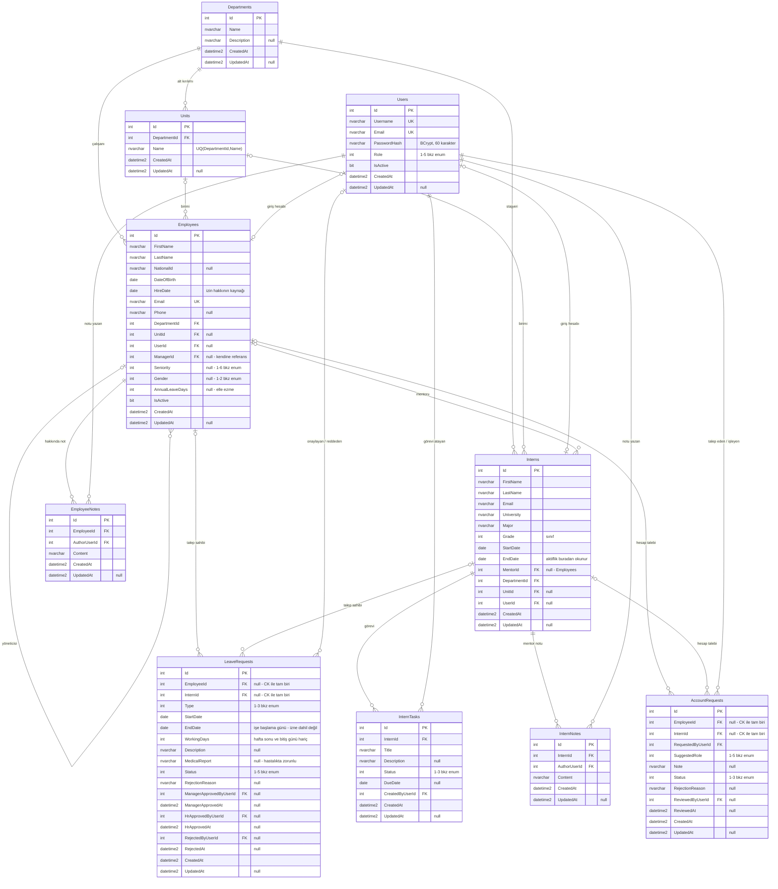

# Veri Modeli ve ER Diyagramı

> Teslimat §7.4 — *Veri modeli / ER diyagramı*
> Şemanın tek doğruluk kaynağı `db/` klasöründeki SQL script'leridir; bu doküman
> onların okunabilir özetidir. Çelişki olursa **SQL doğrudur**.

Veritabanı: **SQL Server** · `HRManagementDb` · şema `dbo` · **10 tablo**

---

## 1. ER Diyagramı

> `LeaveRequests` ve `AccountRequests` tablolarındaki `Users` bağı diyagramda tek
> çizgiyle gösterildi; gerçekte **üç ayrı yabancı anahtar** vardır
> (`ManagerApprovedByUserId`, `HrApprovedByUserId`, `RejectedByUserId` /
> `RequestedByUserId`, `ReviewedByUserId`).

---

## 2. Tablolar — ne için var

| Tablo | Sorumluluğu |
|---|---|
| `Departments` | Üst düzey organizasyon birimi. Genel Müdür dahil herkes bir departmana bağlıdır. |
| `Units` | Departmanın alt kırılımı (ör. *Bilgi Teknolojileri → Sistem ve Network*). Opsiyonel: her departmanın birimi olmayabilir. |
| `Users` | Giriş hesabı. Kişiden ayrıdır: hesabı olmayan çalışan da, çalışan kaydı olmayan hesap da (ör. Admin) olabilir. |
| `Employees` | Çalışan kaydı. `ManagerId` ile kendine referans verir — raporlama zinciri buradan kurulur. |
| `Interns` | Stajyer kaydı. `IsActive` kolonu **yoktur**; aktiflik `EndDate`'ten okunur. |
| `LeaveRequests` | İzin talebi ve iki aşamalı onay izi. |
| `EmployeeNotes` | Çalışan detayındaki İK/yönetici notları. |
| `InternTasks` | Stajyere atanan görevler (durum takipli). |
| `InternNotes` | Mentorun stajyer hakkındaki geri bildirimleri. |
| `AccountRequests` | Hesap açma talebi. İK/sistem talep eder, Admin onaylar. **Şifre burada tutulmaz.** |

---

## 3. Enum değerleri

Bu sayılar veritabanında saklanır. **Değiştirilirse mevcut kayıtlar sessizce
başka anlama gelir** — değişiklik gerekirse veri taşıma script'i şarttır.

| Kolon | Değerler |
|---|---|
| `Users.Role`, `AccountRequests.SuggestedRole` | `1` Admin · `2` HR · `3` Manager · `4` Employee · `5` Intern |
| `Employees.Seniority` | `1` Genel Müdür · `2` GM Yardımcısı · `3` Müdür · `4` Müdür Yrd. · `5` Kıdemli Uzman · `6` Uzman — *sayı küçüldükçe kıdem yükselir* |
| `Employees.Gender` | `1` Erkek · `2` Kadın · `NULL` belirtilmemiş |
| `LeaveRequests.Type` | `1` Yıllık · `2` Ücretsiz · `3` Hastalık |
| `LeaveRequests.Status` | `1` Beklemede (yönetici onayı) · `2` İK onayı bekliyor · `3` Onaylandı · `4` Reddedildi · `5` Geri çekildi (onaylıyken, izin başlamadan sahibi iptal etti) |
| `InternTasks.Status` | `1` Atandı · `2` Devam ediyor · `3` Tamamlandı |
| `AccountRequests.Status` | `1` Beklemede · `2` Onaylandı · `3` Reddedildi |

---

## 4. Kısıtlar ve indeksler — neden var

| Kısıt | Ne garanti eder |
|---|---|
| `CK_LeaveRequests_Requester` | Talep sahibi `EmployeeId` **veya** `InternId`'den **tam olarak biri**. Uygulama hatalı olsa bile bozuk kayıt giremez. |
| `CK_AccountRequests_Subject` | Aynı kural hesap talepleri için. |
| `CK_Employees_Seniority` | Kıdem 1–6 aralığında (enum dışı değer engellenir). |
| `CK_Employees_AnnualLeaveDays` | Elle verilen izin hakkı negatif olamaz. |
| `UQ_Users_Username` / `UQ_Users_Email` | Aynı kullanıcı adı/e-posta iki kez açılamaz. |
| `UQ_Employees_Email` | Çalışan e-postası benzersiz. |
| `UQ_Units_Dept_Name` | Aynı departmanda aynı adlı iki birim olamaz. |
| `UX_AccountRequests_PendingEmployee` / `...PendingIntern` | **Filtreli benzersiz indeks:** bir kişi için aynı anda yalnızca **bir** bekleyen hesap talebi olabilir. |
| `IX_Units_DepartmentId`, `IX_Employees_UnitId`, `IX_Interns_UnitId`, `IX_AccountRequests_Status` | Sık filtrelenen kolonlar için performans indeksleri. |

### Neden `OwnerType + OwnerId` değil

`LeaveRequests`'te talep sahibini tek bir sütun çiftiyle ("tip + id") tutmak
reddedildi: o modelde **yabancı anahtar kurulamaz**, yani veritabanı işaret
edilen kaydın gerçekten var olduğunu doğrulayamaz. İki nullable kolon + `CHECK`
kısıtı, bütünlüğü veritabanı seviyesinde korur.

---

## 5. Saklanan ve saklanmayan veriler

Bilinçli bir kural var: **girdileri sonradan değişebilen türetilmiş veri saklanmaz.**

| Veri | Saklanıyor mu | Gerekçe |
|---|---|---|
| Yıllık izin **hakkı** | Hayır | `HireDate`'ten kıdem hesaplanarak bulunur (İş Kanunu md. 53). Saklansaydı kıdem ilerledikçe güncellenmesi gerekir, unutulursa tutarsızlık oluşurdu. `Employees.AnnualLeaveDays` yalnızca **elle geçersiz kılma** içindir. |
| **Kullanılan** izin günü | Hayır | Onaylanmış + bekleyen taleplerden toplanır. Tek doğruluk kaynağı taleplerin kendisidir. |
| Talebin **iş günü** sayısı | **Evet** (`WorkingDays`) | Girdileri (başlangıç/bitiş tarihi) talep açıldıktan sonra değişmez. Değişmeyen girdiden hesaplanan değeri saklamak tutarsızlık riski yaratmaz. |
| **Pozisyon** | Hayır | *Birim (yoksa Departman) + Kıdem* birleşiminden gösterim anında türetilir. Serbest metin pozisyon alanı tutarsız veri üretiyordu. |

---

## 6. Ortak sözleşmeler

- **Tüm tarihler UTC** tutulur (`SYSUTCDATETIME()`); kullanıcıya gösterilirken çevrilir.
  Sunucunun saat dilimi değişirse karşılaştırmalar bozulmasın diye.
- **`UpdatedAt` hiç güncellenmediyse `NULL`** bırakılır. `CreatedAt` ile aynı değere
  set etmek "bu kayıt hiç değişmedi" bilgisini yok ederdi.
- **"Bu işlemi kim yaptı" sorusunun cevabı her zaman `Users`'tır**, `Employees` değil:
  not girecek İK uzmanının çalışan kaydı olmayabilir ama hesabı mutlaka vardır.
- `PasswordHash` kolonu `nvarchar(255)`: BCrypt hash'i 60 karakterdir; sütun dar
  olursa hash sessizce kırpılır ve giriş **hiç** çalışmaz.

---

## 7. Script sırası

| Sıra | Dosya | Zorunlu |
|---|---|---|
| 1 | `db/05_full_setup.sql` | Evet — tüm tablolar (01–04, 06, 07, 08, 10, 14 dahil) |
| 2 | `db/11_units.sql` | Evet — `Units` + `Employees.UnitId` / `Interns.UnitId` |
| 3 | `db/12_seed_org_kadro.sql` | Hayır — örnek kadro verisi |
| 4 | `db/13_flatten_manager_chains.sql` | 12 çalıştırıldıysa evet |
| 5 | `db/15_backfill_employee_gender.sql` | Hayır — eski kayıtların cinsiyet backfill'i |

Ayrıntı: [`db/README.md`](../db/README.md) · Kurulum: [`README.md`](../README.md#22-veritabanını-oluştur)
